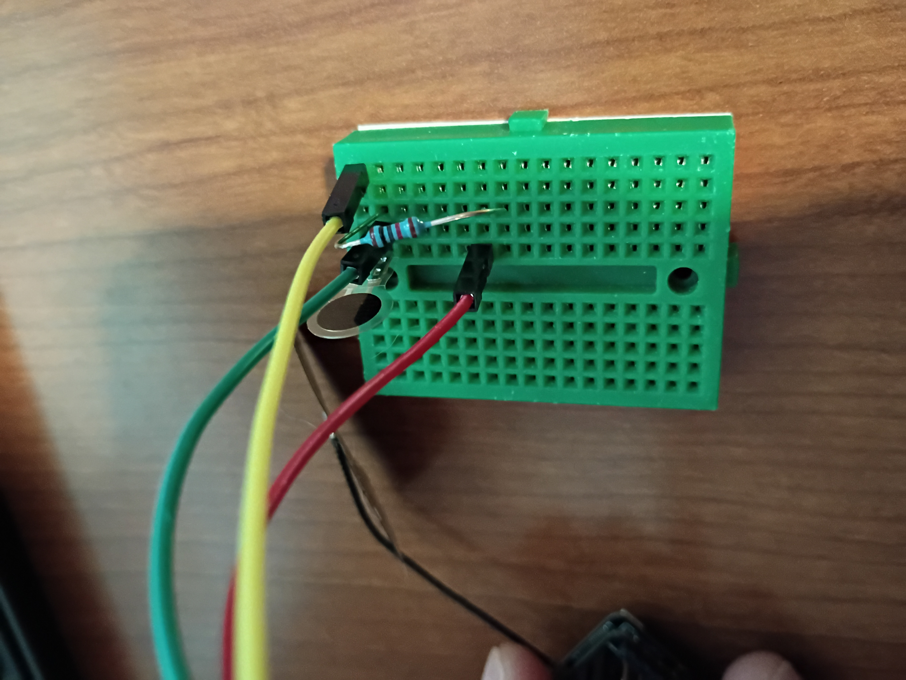

# Assembly details

## Monitoring board prototype
* XIAO ESP32 Sense S3 presoldered board was prepared by mounting heat sync to underside
* breadboard and breadboarding wires used to prototype connections as shown
* Thin film force sensor is connected to ESP32 board pin D0 with 10k Ohm resistor 
    * 3V3 pin on S3 to force sensor
    * force sensor to D0 pin on S3 (parallel)
    * (parallel) to 10k Ohms resistor
    * 10k Ohms resistor to GND pin on S3 

### Breadboard

### Sense S3

