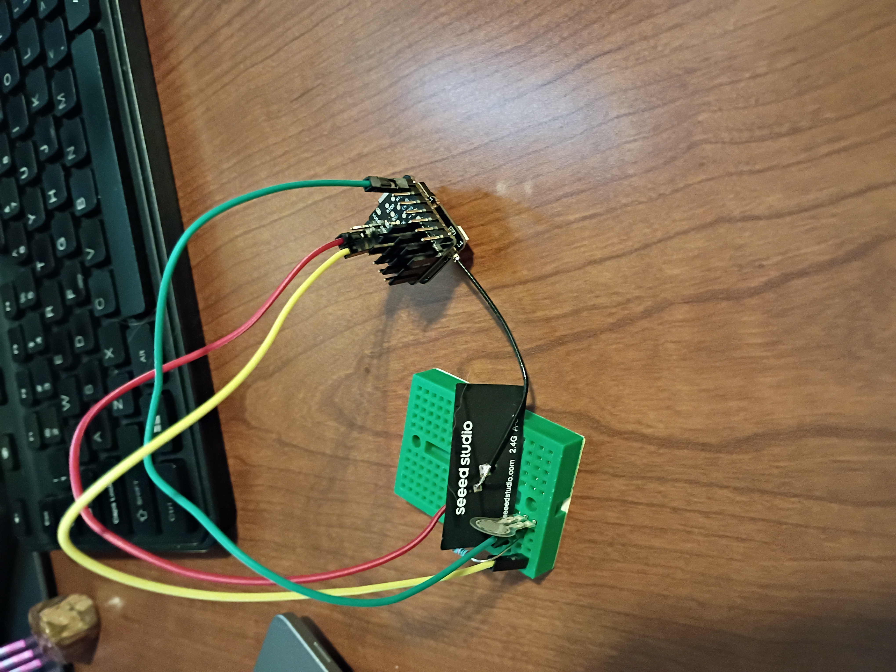

# Stool Pigeon
Welcome to the workspace for the open-source project Stool Pigeon. The goal of this project is to create a toilet-mounted device that visually, audibly, and or otherwise monitors bowel movements. 

# Values
* Accessibility 
* Privacy  
* Affordability
* Community 

# What this project needs
* 3D case design
* Board and perpheral design
* Ideas and enthusiasm
* Open-source experience

# What is here
* Some prototype Arduino IDE configuations
* A logging web server used to collect data from device while running and testing
* The Platform IO project used to build the device 
* Some unfinished 3D case designs originally made in Tinkercad

# Project Status
## Progress
* circuit design for basic FSR usage
* connected to wifi
* connected to logging webserver on laptop

## To Do Next
* document hardware layout
* guide for wifi credential deps
* switch to logging via POST 
* add in image to POST request
* wake from deep sleep with pressure
* log to webserver on wake

## Future Improvements
* convert to c++

## Prototype Picture

# Notes

## Sketch Uploads
* Correct port only appears after device is plugged in
* open serial monitor manually

## verify / compile errors
* need to install and select XIAO board (SenseS3)

## Force Sensitive Resistors
* Use touch pin to wake
* take reading from FSR to determine seated time and person's identity

## Wifi
* 2.4 Ghz only
